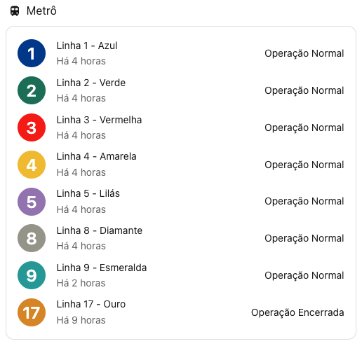
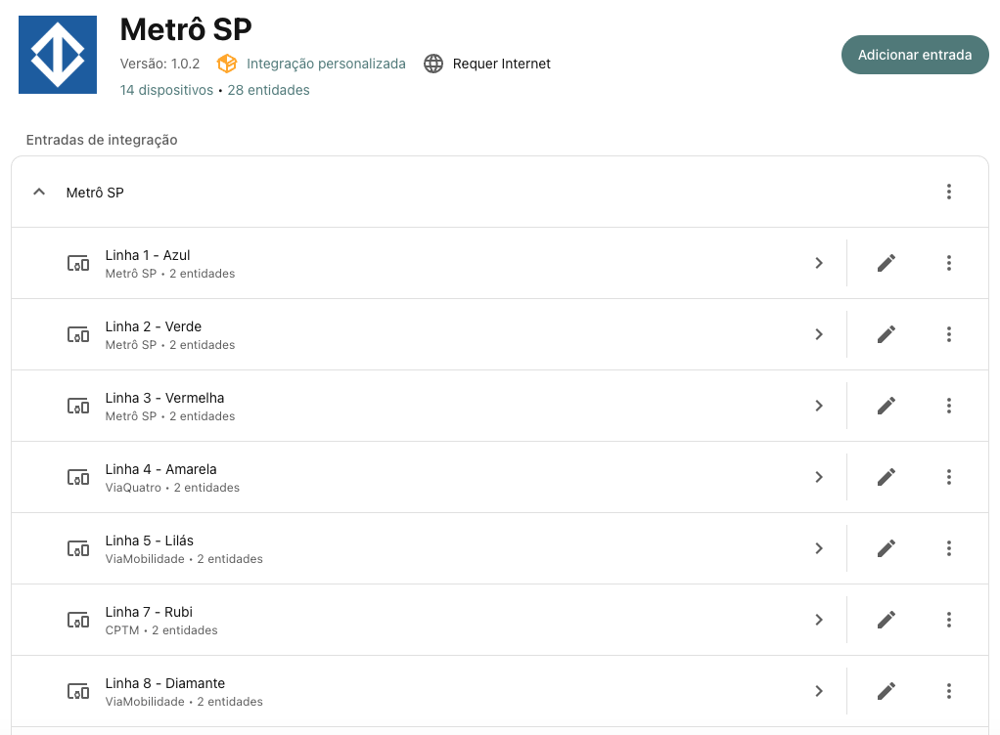

# Metrô SP para Home Assistant

---

Integração custom para o [Home Assistant](https://www.home-assistant.io/) que exibe o status operacional em tempo real
das linhas do Metrô SP e CPTM.

## Linhas suportadas

| Linha | Nome      | Operador      |
|-------|-----------|---------------|
| 1     | Azul      | Metrô SP      |
| 2     | Verde     | Metrô SP      |
| 3     | Vermelha  | Metrô SP      |
| 4     | Amarela   | ViaQuatro     |
| 5     | Lilás     | ViaMobilidade |
| 6     | Laranja   | Linha Uni     |
| 7     | Rubi      | TIC Trens     |
| 8     | Diamante  | ViaMobilidade |
| 9     | Esmeralda | ViaMobilidade |
| 10    | Turquesa  | CPTM          |
| 11    | Coral     | Trivia Trens  |
| 12    | Safira    | Trivia Trens  |
| 13    | Jade      | Trivia Trens  |
| 15    | Prata     | Metrô SP      |
| 17    | Ouro      | ViaMobilidade |

## Sensores criados

Cada linha gera um **device** independente com um sensor:

| Sensor   | Entity ID                              | Descrição                                     |
|----------|----------------------------------------|-----------------------------------------------|
| Operação | `sensor.metro_sp_linha_X_cor_operacao` | Status atual da linha (ex: "Operação Normal") |

### Atributos do sensor de Operação

| Atributo       | Descrição                                                                       |
|----------------|---------------------------------------------------------------------------------|
| `description`  | Descrição detalhada de ocorrências (ou o status quando não há texto específico) |
| `status_code`  | Código numérico do status reportado pela API                                    |
| `status_color` | Cor associada ao status, como reportada pela API                                |
| `color_name`   | Nome da cor da linha                                                            |
| `color_hex`    | Código hexadecimal da cor da linha                                              |
| `line_code`    | Número da linha                                                                 |

## Instalação

### Manual

1. Copie a pasta `custom_components/metro_sp` para o diretório `custom_components` da sua instalação do Home Assistant.
2. Reinicie o Home Assistant.
3. Acesse **Configurações → Dispositivos e Serviços → Adicionar Integração** e pesquise por **Metrô SP**.
4. Confirme a instalação. Os sensores serão criados automaticamente.

### HACS

1. No Home Assistant, acesse **HACS → Integrações**.
2. Clique no menu (⋮) e selecione **Repositórios personalizados**.
3. Adicione a URL `https://github.com/roquerodrigo/ha-metro-sp` e selecione a categoria **Integração**.
4. Clique em **Baixar** na integração **Metrô SP**.
5. Reinicie o Home Assistant.
6. Acesse **Configurações → Dispositivos e Serviços → Adicionar Integração** e pesquise por **Metrô SP**.

## Atualização dos dados

Os dados são atualizados a cada **1 minuto** via polling na API pública do Metrô SP. Nenhuma credencial é necessária.

## Apoie o projeto

Esta integração é desenvolvida e mantida em tempo pessoal. Se for útil para você, considere [patrocinar o trabalho](https://github.com/sponsors/roquerodrigo) — é o que mantém o desenvolvimento, os testes e as publicações acontecendo.

## Licença

[MIT](LICENSE)
